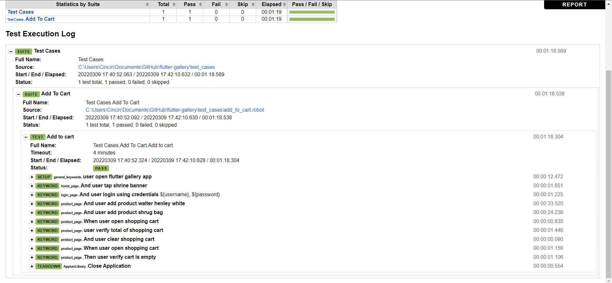

# flutter-gallery

Setup
1. Install Python 3.*
2. Install Robot Framework 
3. Install AppiumLibrary
4. Change change_to_device_udid at flutter-gallery/frameworks/app_config.robot to udid of device
5. Download apk here -> https://github.com/flutter/gallery/releases/download/v2.9.2/flutter_gallery_Android.apk
6. Move apk to flutter-gallery/frameworks/ and rename to flutter_gallery_Android.apk

How To Run
1. cd flutter-gallery
2. robot -d .\reports .\test_cases\

Reports
